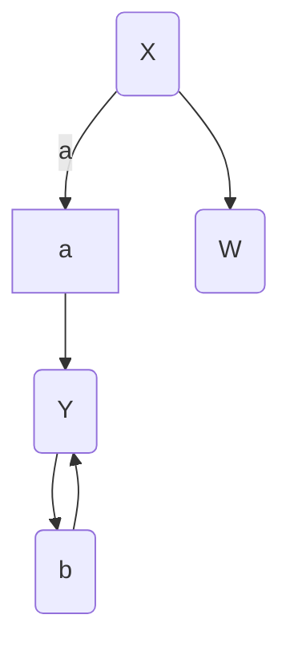

# PyTorch Introduction

What is PyTorch ?

1. Open source machine learning library
2. Developed by Facebook'sAI Research Lab
3. It leverages the power of GPU
4. It uses dynamic computational graphs for automatic computation of gradients
5. It makes easier to test and develop new ideas like NNs , ML algorithms and do implement, test our algorithms.

What are the other libraries than PyTorch for doing same tasks ?

1. CNTK Microsoft
2. Caffe and updated version Caffe2
3. TensorFlow and it's updated versions
4. Keras, Theano, MXNET, dy/net , chainer, GLUON

How to represent the data in the PyTorch ?

In NumPy, we have arrays as data structure to store the data inside memory similarly PyTorch has Tensors to store the data inside memory.

Why Tensors are importent in PyTorch ?

Tensors can directly run on GPU for faster computation and also on CPU but numpy arrays can't be run onto the GPU only runnable onto the CPU.

PyTorch has features to create random matrices, zero values matrices, directly from data or  for the models weight intialization

There are the different operation we can perform onto the tensors like addition, indexing, resizing tensor to a particular size using view function.

```python
import torch

# rand function returns random number of given tensor size
x = torch.rand(2, 3) # 2 x 3
y = torch.rand(3,3) # 3x 3

# all zeros
x = torch.zeros(5, 3)

# given data to tensor
data = [4.5 , 53.4, 8.3]
x = torch.tensor(data)

# size of tensor importent in designing large tensor
print(x.size())

# operations
x = torch.rand(3, 3) # 3 x 3
y = torch.rand(3,3) # 3x 3
print(torch.add(x, y))

# accessing particular set of element from starts to end in the tensor
print(x[:, 1)

# resize the tensor to a particular size using view function
x = torch.randn(4, 4)
y = x.view(16) # flattening, usefull with nns
z = x.view(-1, 8) # dynamic dimention, to define the num of patches , dim that we define for the our # input data varies then we can't hardcode the reszing factors

print(x.size())
print(y.size())
print(z.size())

x = torch.randn(1, 4, 32, 24)
y = x.view(8, 2, -1, 3, 8)
print(y.size())
```

NumPy array vs Torch tensors

arrays are desined for CPU only while the Tensor can run on CPU as well as GPU.

Matrix Multiplication in PyTorch used in many NNs implementations

```python
# tensor to numpy arrays
a = torch.ones(5)
b = a.numpy()

# numpy array to tensor
a = numpy.ones(5)
b = torch.from_numpy(a)

# matrix multiplication
import torch
M1 = torch.randn(2, 3)
M2 = torch.randn(3,3)

result = torch.mm(M1, M2)
print(result.size())

# Batch Matrix multiplication
import torch
B1 = torch.randn(10, 3, 4) # 10 , 3x4 matrices
B2 = torch.randn(10, 4, 5) # 10 , 4 x 5 matrices batch
result = torch.bmm(B1, B2)
print(result.size()) # 10, (3, 5)

# Tensor Concatenation
result = torch.cat(T1, T2)

# reduce or increate the dimensions of the tensors
torch.sqeueeze
torch.unsqeueeze
# change tensor dimensions and many more

```

check the docs : https://docs.pytorch.org/docs/stable/torch.html

Computational Graphs : They actually defines the neural network opeations with given inputs.



and 

Automatic Gradient Computation
compute the gradient w.r.t to all the parameters


```python
import torch
x = torch.ones(2, 2)
y = torch.ones(2, 1)

# we compute the gradient of these params and update them thus set true.
w = torch.randn(2, 1, requires_grad=True)
b = torch.randn(1, requires_grad=True)

# prediction
p = torch.sigmoid(torch.mm(x, w) + b)

# cross entropy loss
loss = -y*torch.log(p) - (1-y)*torch.log(1-p)

# cost to minimize it 
cost = loss.mean()

# compute gradient
cost.backward()
# we can see 
print(w.grad)
print(b.grad)
```

Training Procedure of neural networks
1. Define the Neural networks
2. Iterate over a dataset of inputs
3. Process input through the network
4. Compute the loss
5. Propagate the gradients back into the network's parameters
6. Update the weights of the networks.

1. Building Neural Network using PyTorch


How to define a Neural Network class ?

```python

import torch
import torch.nn as nn

# nn.Module class class is the super class of the NNet class
# means NNet class inherits the properties from the nn.Module
class NNet(nn.Module):
    def __init__(self):
        super(NNet, self).__init__()
        # create the layers which will be needed to define the forward pass of the nns
    
    def forward(self, x):
        # define the feed-forward pass of the nns

# we don't needed to define the backward pass into the our NNet class.

```

WE will defin CNN for MNIST


```python
import torch
import torch.nn as nn
import torch.nn.functional as F

class Net(nn.Module):
    def __init__(self):
        super(Net, self).__init__()
        # Depth : 1 input image channel, filter size : 6 output channels, grad scale image : 5x5 square : convolution kernel
        self.conv1 = nn.Conv2d(1, 6, 5)
        self.conv2 = nn.Conv2d(6, 16, 5)
        # an affine operation: y = Wx + b
        self.fc1 = nn.Linear(16 * 5 * 5, 120)
        self.fc2 = nn.Linear(120, 84)
        self.fc3 = nn.Linear(84, 10)

    def forward(self, x):
        # Max pooling over a (2, 2) window
        x = F.max_pool2d(F.relu(self.conv1(x)), (2, 2))
        # If the size is a square you can only specify a single number
        x = F.max_pool2d(F.relu(self.conv2(x)), (2, 2))
        # we don't know what batch size we are apply to these tensor thus we just flatten the tensor
        # because convolution is the trasnformation from volume to volume but the fully connected layers are features to features
        # we can also use the flatten function also
        x = x.view(-1, self.num_flat_features(x))
        x = F.relu(self.fc1(x))
        x = F.relu(self.fc2(x))
        x = self.fc3(x)
        return x

    def num_flat_features(self, x):
        size = x.size()[1:]  # all dimensions except the batch dimension
        num_features = 1
        for s in size:
            num_features *= s
        return num_features

```

2. Iterate over the dataset of Input
- Images : Pillow, OpenCV are usefull
- Audio : Scipy and librosa
- Text : NLTK and SpaCy

Loading data into the memory as numpy array then convert into the tensor for GPU if we have access to it.

Loading Image data - with torchvision
torchvision is extremly easy to load the exisiting benchmarkding datasets.


```python
# other than hyperparameter tuning, and inferencing
# we do most of time preprocessing, transforming, feature # engineering dataset for the our nn model.

import torchvision
import torchvision.transforms as transforms

transform = transforms.Compose([
    transforms.ToTensor(),
    transforms.Normalize((0.5, 0.5, 0.5), (0.5, 0.5, 0.5))
])

trainset = torchvision.datasets.CIFAR10(root='./data', train=True, download=True, transform=transform)
trainloader = torch.utils.data.DataLoader(trainset, batch_size=4, shuffle=True, num_workers=2)


testset = torchvision.datasets.CIFAR10(root='./data', train=False, download=True, transform=transform)
testloader = torch.utils.data.DataLoader(testset, batch_size=4, shuffle=False, num_workers=2)

```

Process the input through the network via feed forward functions

Then compute the loss
Loss function
A loss function takes the (output, target) pair of inputs.

Computes a value that estimates how far away the output is from the target.

There are several different loss functions under the nn package.

A simple loss can be:

nn.MSELoss

It computes the mean-squared error between the input and the target

```
output = net(output)
target = torch.randn(10)
# a dummy target ,for example 
target = target.view(1, -1)
#make it same shape as output
criterion = nn.MSELoss()
loss = criterion(output, target)

```

Then Propagate the gradient back to the networks parameters

and upate the weights of the networks

```python

import torch.optim as optim

# create our optimizer

optimizer = optim.SGD(net.parameters(), lr=0.01)
# in our training loop
optimizer.zero_grad()
output = net(input)
loss = criterion(output, target)
loss.backward()
optimizer.step() #update the params
```

Total training sample : 80000, batch_size = 50 then each iteration takes 30secs then how many hours of 3 epoch training ?

One epoch : iterate through all the training set of the all batches
